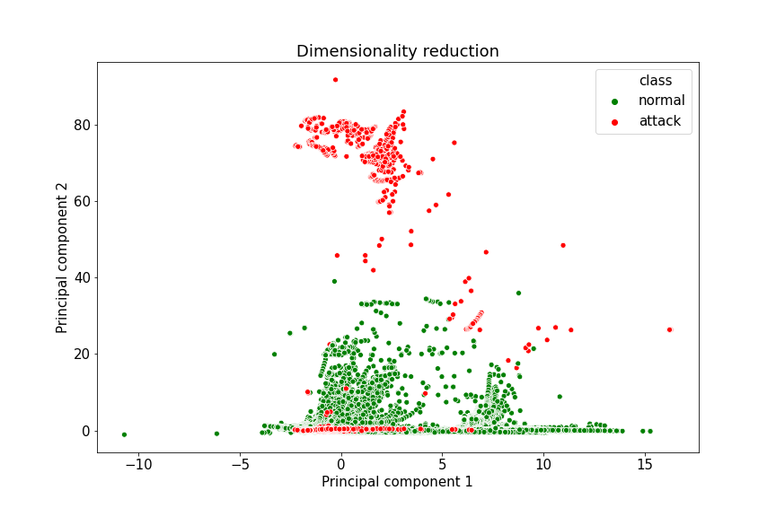
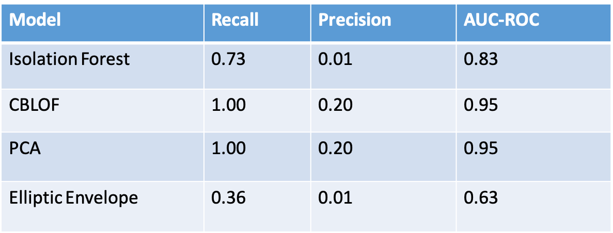
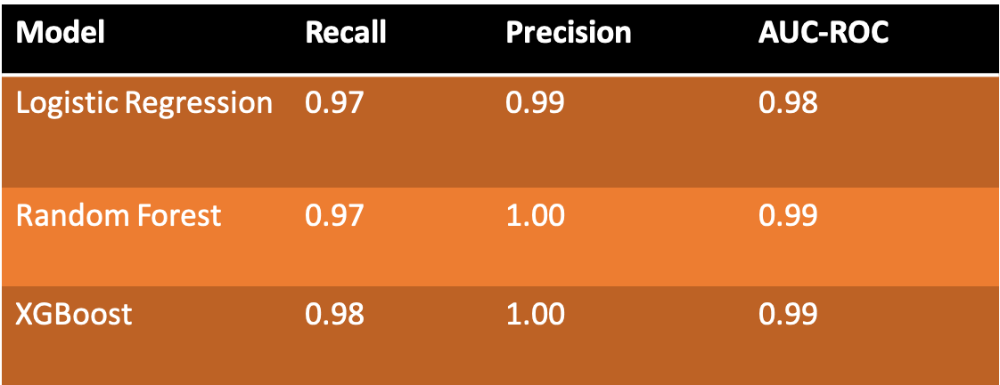
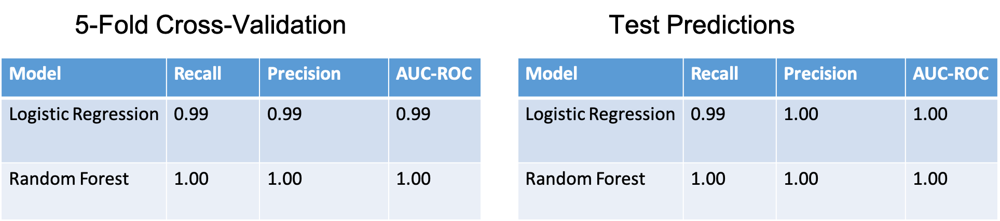

# Anomaly Detection of Network Intrusion

## Data Information

 The dataset can be downloaded from  [Harvard Dataverse](https://dataverse.harvard.edu/dataset.xhtml?persistentId=doi:10.7910/DVN/OPQMVF)

## Dimesionality Reduction

PCA dimensionality reductions of the dataset

## Unsupervised Learning

In the unsupervised setting, the class labels of the training set are not available.  In the current problem, the true labels were ignored during training in order to reflect a real-world scenario. Hence, the unsupervised classification models were used to predict the true labels for each record. We trained Isolation Forest, Cluster-Based Local Outlier Factor (CBLOF), Principal Component Analysis (PCA) and Elliptic Envelope. In real-world unsupervised problems, the business have to validate the predicted results due to absence of ground truth. However, in this problem the predicted labels were validated with the true labels and the results below show that the unsupervised models predicted so many fasle positives.

## Semi-Supervised Learning
In the semi-supervised setting, a large unlabeled dataset and a small labeled dataset are given. The goal is to train a classifier on the entire dataset that would predict the labels of the unlabeled data points. In the present problem, we created 84\%  unlabeled data and 16\% labeled data points. Using self-training semi-supervised learning method, we trained Logistic Regression and Random Forest as base classifiers. We use the ground truth (true lables) of the unlabeled dataset to validate the performance of the models, but in reality the ground truth of the unlabeled data points will not be provided. The results are shown below

## Supervised Learning

In the supervised setting, we trained Logistic Regression and Random Forest on the enitre labeled dataset. The results are shown below

