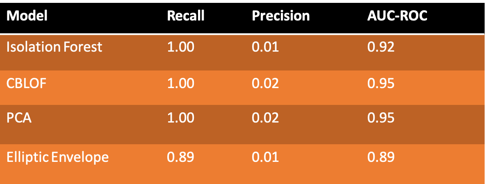
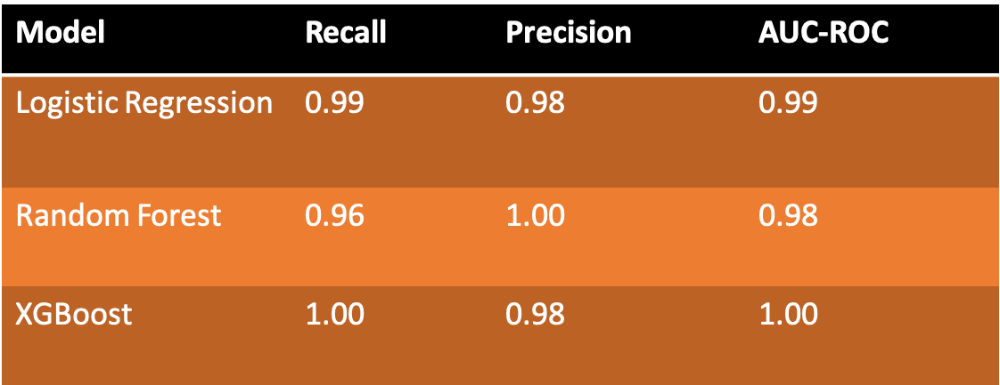

# Anomaly Detection in Network Intrusion

The goal of this project is to present different machine learning methods for anomaly detection. We have constructed three different datasets that were used to demonstrate unsupervised, semi-supervised, and supervised learning methods. 

## Data Information

The dataset can be downloaded from  [dataverse.harvard.edu](https://dataverse.harvard.edu/dataset.xhtml?persistentId=doi:10.7910/DVN/OPQMVF)

## Dimensionality Reduction

## Unsupervised Learning

In the unsupervised setting, the class labels of the training set are not available. In the
current problem, the true labels were ignored during training in order to reflect a real-world scenario. Hence, the unsupervised classification models were used to predict the true labels for each record. We trained the following unsupervised models:

- Isolation Forest

- Cluster-Based Local Outlier Factor (CBLOF)

- Principal Component Analysis (PCA)

- Elliptic Envelope.

In the real-world unsupervised problems, the business has to validate the predicted results due to absence of ground truth. In the present problem, however, the predicted labels were validated with the true labels, and the results below show that the unsupervised models predicted so many false positives, but with perfect recall.

## Semi-Supervised Learning

In the semi-supervised setting, a large unlabeled dataset and a small labeled dataset are given. The goal is to train a classifier on the entire dataset that would predict the labels of the unlabeled data points in the training set. This is called transductive semi-supervised learning. In the present problem, we have created a semi-supervised learning dataset consisting of 92\%  unlabeled data points and 8\% labeled data points.

Using self-training semi-supervised learning method, we've trained the following three base classifiers:

- Logistic Regression

- Random Forest 

- XGBoost

We use the ground truth (true lables) of the unlabeled dataset to validate the performance of the self-training semi-supervised learning models, but in reality the ground truth of the unlabeled data points will not be provided. The results are shown below

## Supervised Learning

In the supervised setting, the class label for each record in the training set are provided and the goal is to train a classifier that would be used for prediction on unseen data. Here, we have trained two classifiers

- Logistic Regression

- Random Forest 

The results below show that the two classifiers perform extremely well on the dataset. The AUC-ROC and AUC-PRC are 100\% for on the training (cross-validation) and test sets.

